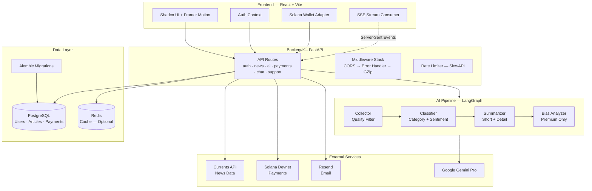

# AI News Aggregator (NewsAI)

[](https://github.com/Atharva0506/news-app/actions/workflows/ci.yml)


👋 Hi there! Welcome to the repository.

This is a next-generation news platform I built to demonstrate the power of **AI Agents** in aggregating, classifying, and summarizing news in real-time. It features a specialized dashboard with "Deep Analysis" streaming, an AI Chat Assistant, and premium subscription tiers.

👉 **Live Demo:** [https://newsai.atharvanaik.me/](https://newsai.atharvanaik.me/)
👉 **Blog Post:** [https://atharvanaik.me/posts/news-ai](https://atharvanaik.me/posts/news-ai)

> [!NOTE]
> I am currently using **Free Tier APIs** for both the LLM (Gemini) and the News data source. This means the application has certain rate limits. If you encounter issues or slow responses, it's likely due to these quotas. Thanks for understanding!

## 🏗️ Architecture



## 🚀 Key Features

-   **Smart News Feed**: Aggregates news from various sources with advanced filtering (Category, Sentiment, Search).
-   **Deep Analysis Agent**: Uses a **LangGraph** multi-agent system (Collector -> Classifier -> Summarizer -> Bias Analyzer) to provide in-depth article insights, streaming results in real-time via Server-Sent Events (SSE).
-   **Daily Briefing**: Auto-generated, cached daily summary of your feed.
-   **AI Chat Assistant**: Ask questions about news articles or your feed using RAG (Retrieval Augmented Generation).
-   **Premium Subscriptions**: Solana-based payment integration (Devnet) for upgrading to Pro plans.
-   **Authentication**: Secure JWT authentication with Access/Refresh token rotation and Google/GitHub OAuth support.

## 🛠️ Tech Stack

### Frontend
-   **Framework**: React (Vite)
-   **Styling**: Tailwind CSS, Shadcn UI, Framer Motion
-   **State/API**: Context API, Custom Hooks, Fetch API (with Interceptors)

### Backend
-   **Framework**: FastAPI (Python)
-   **AI/LLM**: LangChain, LangGraph, Google Gemini Pro
-   **Database**: PostgreSQL (SQLAlchemy Async), Redis (Caching)
-   **Auth**: OAuth2 with Password Bearer (JWT)

## 📦 Installation & Setup

If you want to run this locally, follow these steps:

### Prerequisites
-   Node.js (v18+)
-   Python (v3.10+)
-   PostgreSQL
-   Redis (Optional, for production caching)

### Backend Setup

1.  Navigate to the backend directory:
    ```bash
    cd backend
    ```

2.  Create and activate a virtual environment:
    ```bash
    python -m venv venv
    source venv/bin/activate  # On Windows: venv\Scripts\activate
    ```

3.  Install dependencies:
    ```bash
    pip install -r requirements.txt
    ```

4.  Configure Environment Variables:
    Copy `.env.example` to `.env` and fill in your keys.
    ```bash
    cp .env.example .env
    ```

5.  Start the Server:
    ```bash
    uvicorn app.main:app --reload
    ```
    API docs: `http://localhost:8000/docs`

### Frontend Setup

1.  Navigate to the frontend directory:
    ```bash
    cd frontend
    ```

2.  Install dependencies:
    ```bash
    npm install
    # or
    pnpm install
    ```

3.  Start the Development Server:
    ```bash
    npm run dev
    # or
    pnpm dev
    ```
    Access the app at `http://localhost:5173`

## 🐳 Docker Setup

Run the entire application (Frontend + Backend + Database) with a single command:

1.  Ensure **Docker** and **Docker Compose** are installed.
2.  Configure `backend/.env` (copy from `.env.example`).
3.  Run:
    ```bash
    docker compose up --build
    ```
    - **Frontend**: `http://localhost:80`
    - **Backend API**: `http://localhost:8000`
    - **Database**: `localhost:5432`

## 🤝 Support & Issues

If you find a bug or have a suggestion, please feel free to:
-   **Report an Issue**: [GitHub Issues](https://github.com/Atharva0506/news-app/issues)
-   **Contact Me**: [atharvan.coder@gmail.com](mailto:atharvan.coder@gmail.com)

## 📝 License

This project is licensed under the **MIT License**. Feel free to use and modify it for your own projects!