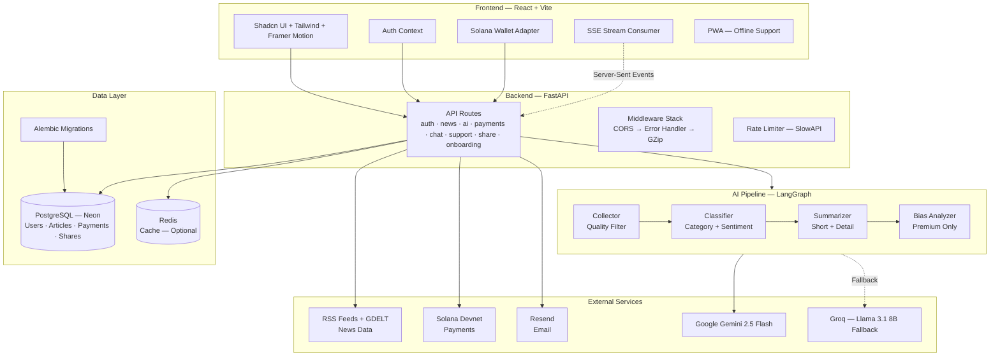

# AI News Aggregator (NewsAI)

[](https://github.com/Atharva0506/news-app/actions/workflows/ci.yml)


A next-generation AI-powered news platform that aggregates, classifies, and summarizes news in real-time using a multi-agent LangGraph pipeline. Features a polished, production-grade dashboard with deep analysis streaming, an AI Chat Assistant, social sharing, personalized onboarding, and premium subscription tiers via Solana payments.

👉 **Live Demo:** [https://newsai.atharvanaik.me/](https://newsai.atharvanaik.me/)
👉 **Blog Post:** [https://atharvanaik.me/posts/news-ai](https://atharvanaik.me/posts/news-ai)

> [!NOTE]
> This app uses **Free Tier APIs** for the LLM (Google Gemini) and news data (RSS + GDELT). You may encounter rate limits or slow responses during peak usage. Thanks for understanding!

## 🏗️ Architecture



## 🚀 Key Features

### News & AI
- **Smart News Feed** — Aggregates news from RSS feeds and GDELT with category, sentiment, and keyword filtering.
- **Deep Analysis Agent** — Multi-agent LangGraph pipeline (Collector → Classifier → Summarizer → Bias Analyzer) with **SSE streaming** for instant feedback.
- **Daily Briefing** — Auto-generated, cached daily summary of your personalized feed with **real-time usage tracking**.
- **AI Chat Assistant** — Context-aware conversations with smooth scroll-locking and token-by-token streaming.
- **AI Reliability** — Automatic **Gemini-to-Groq fallback** mechanism to handle rate limits and service interruptions seamlessly.

### User Experience
- **Production-Grade UI** — Clean, minimal design inspired by Stripe, Linear, and Vercel. Dark/light mode, custom scrollbars, micro-animations.
- **Personalized Onboarding** — 3-step setup: language/region → favorite categories → summary style preference.
- **Social Sharing** — ChatGPT-style share modal with conversation preview and platform buttons (Copy Link, X, LinkedIn, Reddit, WhatsApp).
- **Saved Chats** — Save and revisit AI conversations (Pro plan).
- **Public Explore Page** — Browse latest news without an account.
- **PWA Support** — Installable, offline-ready progressive web app.

### Payments & Auth
- **Solana Payments** — On-chain subscription via Phantom/Solflare wallets (Devnet or Mainnet).
- **Tiered Plans** — Free (with 3-day Pro trial), Pro with higher limits and advanced features.
- **Secure Auth** — JWT with access/refresh token rotation, email verification, password reset.
- **Account Management** — Edit profile, change password, soft-delete with 7-day recovery.

### Developer
- **AI Support Bot** — Floating chat widget with streaming responses for instant assistance.
- **Real-time Usage Tracking** — Live-updating token and request meters with plan-based limits (no page refresh required).
- **Billing History** — Full payment transaction log with Solana explorer links.

## 🛠️ Tech Stack

### Frontend
| Technology | Purpose |
|---|---|
| React 18 + Vite 5 | Framework & build tool |
| Tailwind CSS 3.4 | Utility-first styling |
| Shadcn/ui | 50+ accessible components |
| Framer Motion | Animations & transitions |
| TanStack Query | Data fetching & caching |
| Solana Wallet Adapter | Blockchain wallet integration |
| vite-plugin-pwa | Progressive Web App |

### Backend
| Technology | Purpose |
|---|---|
| FastAPI (Python 3.11) | Async API framework |
| LangChain + LangGraph | Multi-agent AI pipeline |
| Gemini 2.5 + Groq | Primary + Fallback LLM setup |
| PostgreSQL (Neon) | Primary database |
| SQLAlchemy (Async) | ORM with Alembic migrations |
| Redis | Optional caching layer |
| SlowAPI | Rate limiting |
| Resend | Transactional email |

## 📦 Installation & Setup

### Prerequisites
- Node.js (v18+) & pnpm
- Python (v3.10+)
- PostgreSQL
- Redis (Optional, for production caching)

### Backend Setup

```bash
cd backend
python -m venv venv
source venv/bin/activate  # Windows: venv\Scripts\activate
pip install -r requirements.txt
cp .env.example .env      # Fill in your API keys
uvicorn app.main:app --reload
```
API docs: `http://localhost:8000/docs`

### Frontend Setup

```bash
cd frontend
pnpm install
cp .env.example .env      # Update if needed
pnpm dev
```
Access at `http://localhost:5173`

## 🐳 Docker Setup

Run the full stack with one command:

```bash
# Configure backend/.env first
docker compose up --build
```
- **Frontend**: `http://localhost:80`
- **Backend API**: `http://localhost:8000`
- **Database**: `localhost:5432`

## 🤝 Support & Issues

- **Report an Issue**: [GitHub Issues](https://github.com/Atharva0506/news-app/issues)
- **Contact Me**: [atharvan.coder@gmail.com](mailto:atharvan.coder@gmail.com)

## 📝 License

This project is licensed under the **MIT License**. Feel free to use and modify it for your own projects!